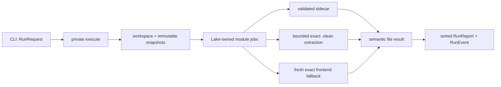

# Native execution architecture designed twice

Date: 2026-07-16

## Design pressure

The common operation must hide three facts that are expensive and easy to misuse:

1. a trusted formatter result may already be a Lake-owned sidecar;
2. a successful `.olean` may contain the same result but require supported extraction; and
3. an ordinary build may require the much slower exact fresh-frontend fallback.

These are implementation sources, not product modes. A caller asks to check selected source
snapshots and receives one deterministic report. It does not select a source, construct a
`Lake.Artifact`, sequence cache lookup before imports, or decide how many Lean processes exist.

This follows the design principles of minimizing cognitive load and unknown dependencies, making
the common interface much smaller than its implementation, hiding volatile representation choices,
avoiding temporal decomposition, pulling special cases downward, and designing around the measured
critical path. Comments and signatures were written here before Prompt 07 implements them.

## Common private interface

The intended application boundary is conceptual until Prompt 07 supplies its first complete
vertical slice; adding a throwing or empty placeholder would create a fake abstraction rather than
prove the contract.

```lean
/- Execute one user intent against immutable source snapshots. This operation owns workspace
discovery, exact module resolution, trusted-result lookup, fallback, resource policy, deterministic
aggregation, and any mode-authorized writes. Events contain presentation facts only. -/
private def execute (request : RunRequest) (emit : RunEvent → IO Unit) : IO (Except RunFailure RunReport)
```

`RunRequest` contains root, selection/ignore intent, mode, validation level, cache policy,
configuration, and the user memory envelope. `RunEvent` contains only stable progress facts such as
the source path and completed/total counts. `RunReport` contains path-sorted file outcomes and
aggregate statistics. `RunFailure` aggregates infrastructure failures that prevented a trustworthy
run. None contains facet names, `.olean` paths, Lake descriptors, extractor manifests, frontend
setups, worker counts, retries, or cache keys.

Internally, both trusted module results and exact fallback results become the same semantic analysis
value before rule reporting. The result does not remember its execution strategy. Missing, stale,
corrupt, or unavailable artifacts select fallback and are not errors. A per-file syntax failure is
report data. Failure to establish the target workspace/toolchain or complete the requested set is a
run failure.

## Alternatives

### A. One Lake-owned run over independent module facets — selected

The private operation resolves selected modules once, fetches their `leanFmtArtifact` jobs, consumes
and validates each returned descriptor against the held source snapshot immediately, and collects
results deterministically. Each facet is independently traceable, cacheable, restorable, and
restartable. A missing embedded result branches privately to the exact frontend fallback.

Lake's `Job.async` delegates to `BaseIO.asTask`. A probe using that same primitive observed maximum
process overlap of four with parent `LEAN_NUM_THREADS=4` and two with
`LEAN_NUM_THREADS=2`; every extractor child was independently assigned `LEAN_NUM_THREADS=1`. Thus a
private parent runtime can bound starts without a public jobs option. This is scheduler control, not
a per-child memory limit: the application must still choose the private value from measured
aggregate RSS, monitor the whole process group, and stop rather than exceed the run envelope.



This design keeps cache and crash boundaries per module. It also permits bounded parallelism on the
measured critical path without a new worker fleet or public jobs option. Prompt 07 must prove that
the target workspace can register/fetch the facet without requiring common callers to know the
facet or mutate the target's configuration.

### B. One serial batch extractor — rejected as the production owner

The batch probe initializes the runtime once, imports each exact target artifact with extension
initialization disabled, writes the compact result, and calls `Environment.freeRegions` before the
next request. Its private `unsafe` helper specializes Lean's `withImportModules` pattern with exact
artifact, level, and `loadExts` arguments that the supported wrapper does not expose. The tested
outputs are correct and its repeated eight-module sequence is memory-stable, but this is evidence
about feasibility—not a supported lifetime contract suitable for production.

Its manifest is also a temporal protocol, one crash loses the remainder, individual Lake cache
restoration no longer naturally owns each output, and serial import remains far above the target.
The production extractor therefore keeps process exit as its reclamation boundary. The batch
specialization stays in `experiments/` until Lean offers a scoped exact-artifact import API.

### C. Isolated exact frontend per source — retained only as fallback

This is the only generally exact ordinary-built path currently known. It naturally isolates
file-local and arbitrary process-global state, but the 2,031-file lower-bound run already took 27.9
minutes and projects beyond 109 minutes. It cannot be the common formatter-integrated path. The
fallback operation must re-execute under the target workspace's exact toolchain and Lake search
path; those are its private responsibilities, not assumptions inherited from the caller. A future
Lean-internal import representation can replace it without changing callers.

## Critical-path measurement

On the corrected guarded eight-module run, independent extraction processes took 4,437 ms total.
The experimental batch took 3,237 ms for its first unique sequence, a 27.0% reduction from avoiding
repeated process startup. Eight repeats (64 exact imports) took 26,089 ms in item timings; the first
eight took 3,237 ms and the last eight 3,265 ms. Batch-process RSS rose from 92,992 KiB to a 155,856 KiB
plateau. This only repeats eight module shapes, so it rejects immediate unbounded growth but does
not establish retention behavior over thousands of distinct modules.

The four-task process-isolated phase completed in 1,660 ms inside the probe (1,997 ms process wall)
and observed maximum overlap four. The entire guarded command—including temporary compilation—
peaked at 1,835,728 KiB aggregate RSS, pressure remained normal, and swap did not grow. The same
guarded command's control phase observed overlap two and 2,451 ms at `LEAN_NUM_THREADS=2`. All
independent, experimental-batch, and concurrent outputs were byte-identical.

The latest independent mean naively projects to 81.3 minutes serial for 8,795 files; the guarded
four-task sample projects to 30.4 minutes. These small, intentionally adverse extraction samples
establish controllable concurrency and rule out serial extraction, not full-workload timing. Prompt
10 must measure a representative distribution before choosing a higher safe task bound or making
any target claim.

## Missing lower-layer capability

Lean exposes `ModuleData.entries` only as opaque extension entries. The supported typed reader
requires constructing/finalizing the transitive import environment even though lean-fmt needs one
small persistent entry from the target module. The smallest useful upstream facilities would be
either a typed callback that reads one named `PersistentEnvExtension` directly from an exact module
artifact, or a scoped exact-artifact import wrapper accepting `arts`, import level, and extension-
loading policy while owning all imported regions. Either would hide extension indexes, opaque casts,
and region lifetime. lean-fmt will not manufacture this contract with `unsafeCast` or promote the
experimental `unsafe` specialization.

Lake also lacks an application-facing portable aggregate-RSS/process-tree hard-limit primitive.
Lean can choose task-pool concurrency and set child environments, and the existing profiler can
monitor a process group on macOS, but portable enforcement may eventually require a narrow OS shim.
No shim is selected without a demonstrated acceptance need.

## Module responsibilities

- `Main` will parse user intent and render events/reports only.
- One private application module will own the entire intent-to-report transaction and error
  aggregation. It is not a facade over public cache, Lake, or worker DTOs.
- Private workspace code will translate a root and selection intent into immutable source/module
  snapshots. Its Lake objects never escape upward.
- Private semantic-result code will combine descriptor fetch, integrity validation, embedded-result
  extraction, and exact fallback selection. Absence of compiler payload in an ordinarily built
  module is a normal fallback input, not a failed Lake job. Callers receive only a semantic file
  result.
- The compiler plugin continues to own in-frontend projection. The package-owned facet continues to
  own declared publication and cache restoration.
- Rules and conservative edits operate on semantic results and source snapshots, never on workers,
  imports, or cache entries.

There is deliberately no compiled `execute` placeholder in this prompt. Prompt 07 must introduce
the interface and its real `check` implementation together so the first caller can test whether the
abstraction is deep rather than merely count declarations.
